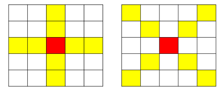

## 파리퇴치3

### 문제 링크

https://swexpertacademy.com/main/code/userProblem/userProblemDetail.do


### 문제

파리 킬러 스프레이를 한 번만 뿌려 최대한 많은 파리를 잡으려고 한다. 스프레이의 노즐이 + 형태로 되어있어, 스프레이는 + 혹은 x 형태로 분사된다. 스프레이를 M의 세기로 분사하면 노즐의 중심이 향한 칸부터 각 방향으로 M칸의 파리를 잡을 수 있다.
다음은 M=3 세기로 스프레이르 분사한 경우 파리가 퇴치되는 칸의 예로, +또는 x 중 하나로 분사된다. 뿌려진 일부가 영역을 벗어나도 상관없다.



한 번에 잡을 수 있는 최대 파리수를 출력하라.


### input

```
2
5 2
1 3 3 6 7
8 13 9 12 8
4 16 11 12 6
2 4 1 23 2
9 13 4 7 3
6 3
29 21 26 9 5 8
21 19 8 0 21 19
9 24 2 11 4 24
19 29 1 0 21 19
10 29 6 18 4 3
29 11 15 3 3 29
```


### OUTPUT

```
#1 64
#2 157
```

