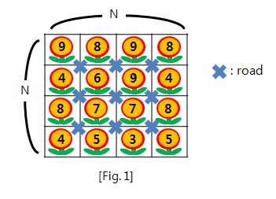
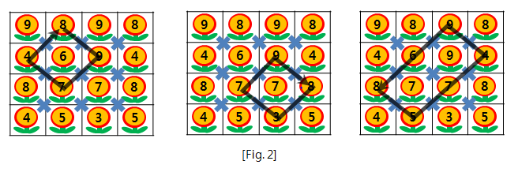
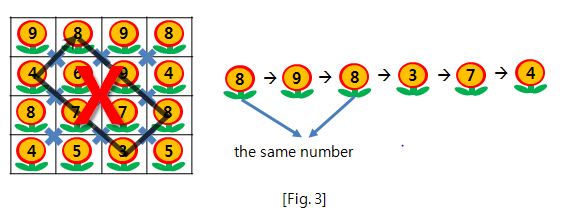

# 디저트 카페 (SWEA_2105)

### 문제 출저

https://swexpertacademy.com/main/code/problem/problemDetail.do?contestProbId=AV5VwAr6APYDFAWu


### 문제

[Fig. 1]과 같이 한 변의 길이가 N인 정사각형 모양을 가진 지역에 디저트 카페가 모여 있다.



원 안의 숫자는 해당 디저트 카페에서 팔고 있는 디저트의 종류를 의미하고

카페들 사이에는 대각선 방향으로 움직일 수 있는 길들이 있다.

디저트 카페 투어는 어느 한 카페에서 출발하여

[Fig. 2]와 같이 **대각선 방향으로 움직이고 사각형 모양을 그리며 출발한 카페로 돌아와야 한다.**



디저트 카페 투어를 하는 도중 해당 지역을 벗어나면 안 된다.

또한, 친구들은 같은 종류의 디저트를 다시 먹는 것을 싫어한다.

즉, [Fig. 3]과 같이 **카페 투어 중에 같은 숫자의 디저트를 팔고 있는 카페가 있으면 안 된다.**




친구들과 디저트를 되도록 많이 먹으려고 한다.

디저트 가게가 모여있는 지역의 한 변의 길이 N과 디저트 카페의 디저트 종류가 입력으로 주어질 때,

임의의 한 카페에서 출발하여 대각선 방향으로 움직이고

서로 다른 디저트를 먹으면서 사각형 모양을 그리며 다시 출발점으로 돌아오는 경우,

디저트를 가장 많이 먹을 수 있는 경로를 찾고, 그 때의 디저트 수를 정답으로 출력하는 프로그램을 작성하라.

만약, 디저트를 먹을 수 없는 경우 -1을 출력한다.


### 입력

입력의 맨 첫 줄에는 총 테스트 케이스의 개수 T가 주어지고, 그 다음 줄부터 T개의 테스트 케이스가 주어진다.

각 테스트 케이스의 첫 번째 줄에는 디저트 카페가 모여있는 지역의 한 변의 길이 N이 주어진다.

그 다음 N 줄에는 N * N 크기의 디저트 카페에서 팔고 있는 디저트 종류에 대한 정보가 주어진다.


### 출력

테스트 케이스 개수만큼 T개의 줄에 각각의 테스트 케이스에 대한 답을 출력한다.

각 줄은 "#t"로 시작하고 공백을 하나 둔 다음 정답을 출력한다. (t는 1부터 시작하는 테스트 케이스의 번호이다)

출력해야 할 정답은 가능한 경우 중 디저트를 가장 많이 먹을 때의 디저트 수 이다.

만약, 디저트를 먹을 수 없는 경우 정답은 -1이다.


### INPUT

```
10
4
9 8 9 8
4 6 9 4
8 7 7 8
4 5 3 5
5
8 2 9 6 6
1 9 3 3 4
8 2 3 3 6
4 3 4 4 9
7 4 6 3 5
6
1 8 9 6 3 9
5 3 1 9 8 2
6 9 3 4 1 2
7 1 1 5 1 9
1 9 6 8 7 3
7 6 4 5 5 5
7
7 4 1 5 1 7 9
9 4 6 1 4 6 8
9 6 4 8 4 7 4
3 2 6 2 4 2 8
4 9 4 6 2 4 7
1 7 6 8 9 5 8
1 9 4 7 2 9 7
...
```

### OUTPUT

```
#1 6
#2 -1
#3 4
#4 4
#5 8
#6 6
#7 14
#8 12
#9 18
#10 30
```

